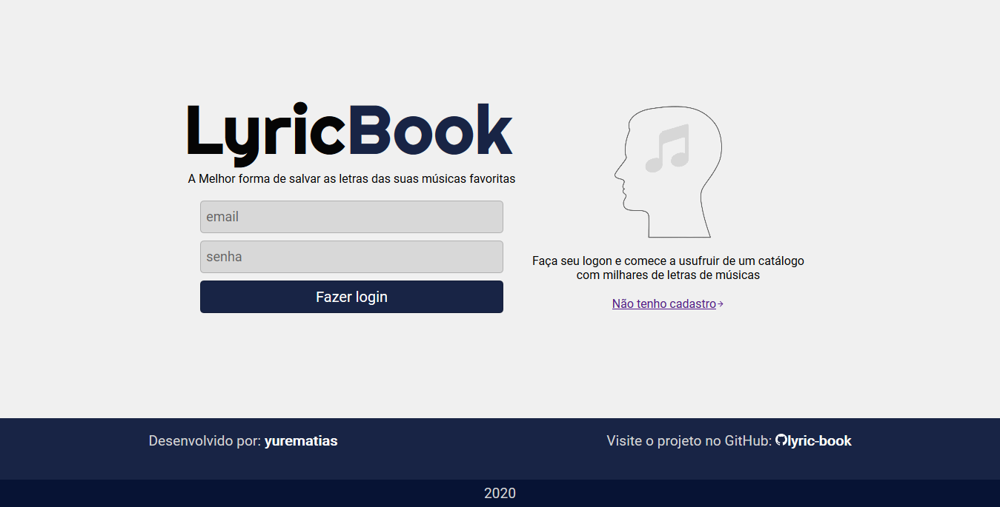
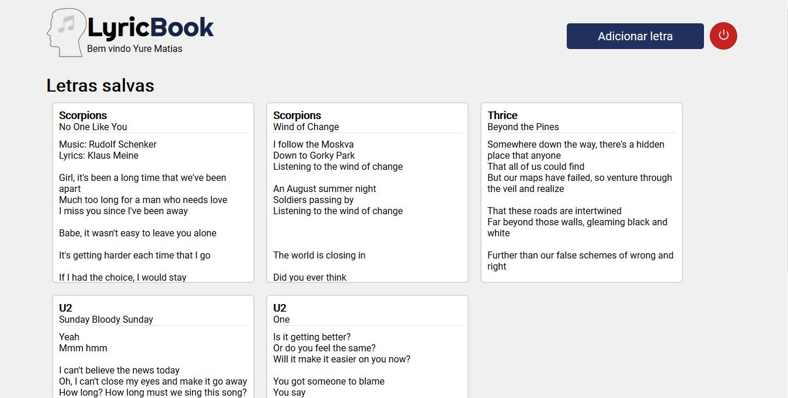
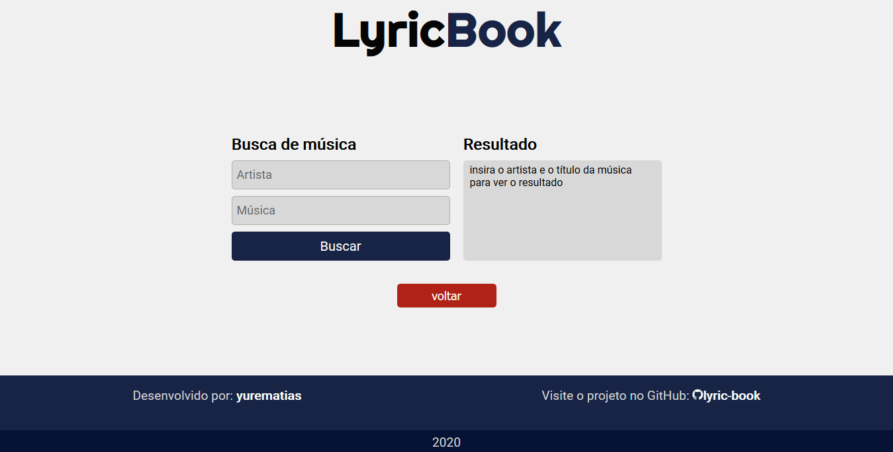
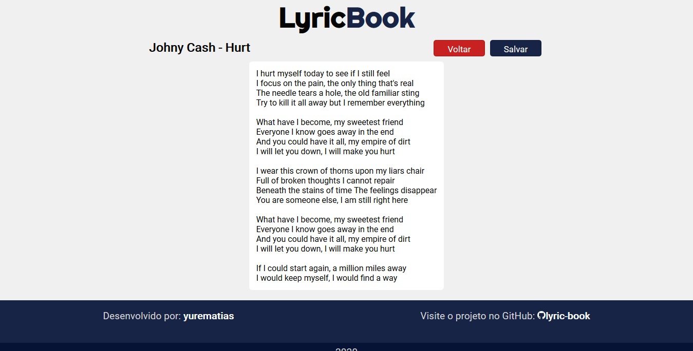

<h1 align="center">
    LyricBook
</h1>

    🎼 Plataforma para usuários buscarem e salvarem letras de músicas. 

    Este projeto foi desenvolvido usando o 
    React e consome músicas da API 
    <a href="https://lyrics.ovh">lyrics.ovh</a>.
     
    A aplicação dá aos usuários a opção de criar perfis para salvar suas músicas favoritas em um backend criado com NodeJS, Express, Knex e em um banco de dados SQLite

    Este projeto foi Criado unicamente com a finalidade de por em prática conhecimentos frontend e backend JavaScript

    <h3>Tela de Login</h3>
    

    <h3> Tela do Perfil</h3>
    

    <h3>Busca de Música</h3>
    

    <h3>Visualização da Letra</h3>
    

